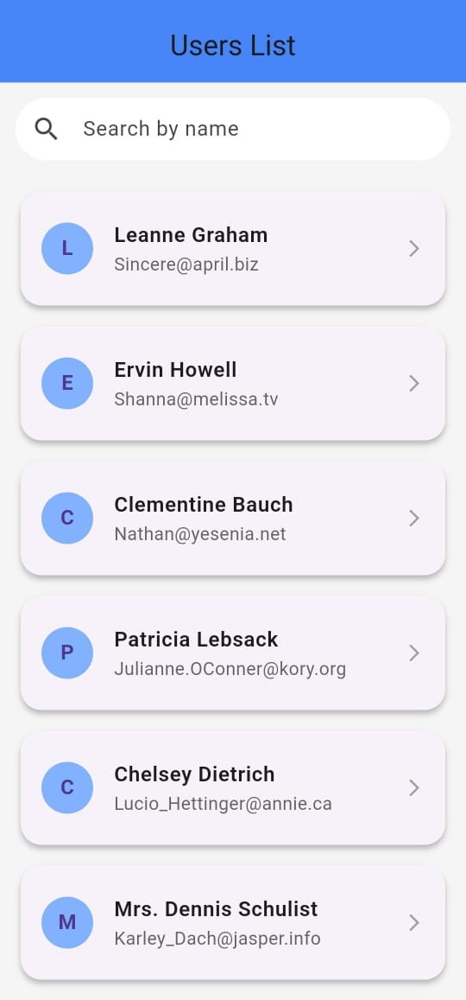
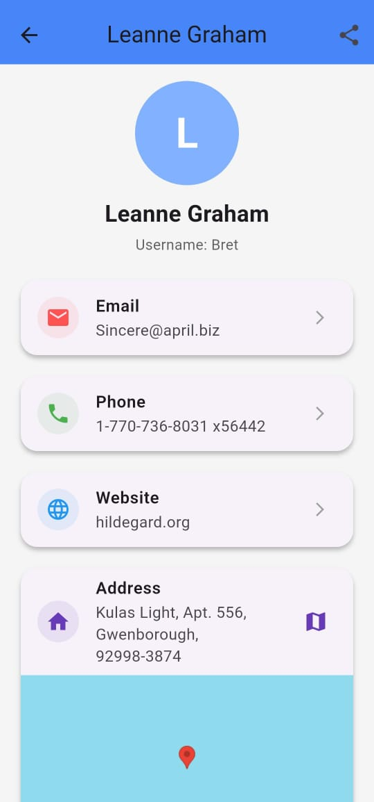
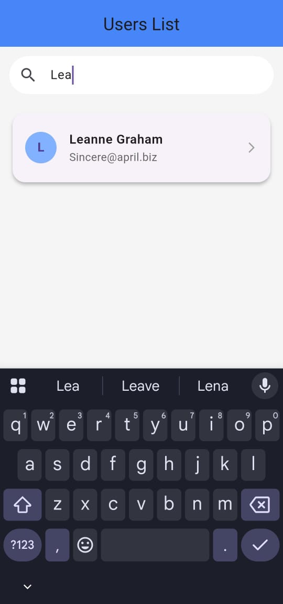

# Appscrip Assignment - Flutter User List App

## 📱 Project Description
A Flutter app that fetches and displays a list of users from a public API with a beautiful and user-friendly interface.

**Key Features:**
- Fetch user data from [JSONPlaceholder API](https://jsonplaceholder.typicode.com/users)
- Show a loading indicator while fetching data
- Error handling for failed API requests
- Pull-to-refresh users list
- Search users by name
- User detail screen with additional info:
   - Name, username, email, phone, website
   - Company information
   - Full address with geo-location
- Share user info with others
- Clickable actions:
   - **Email** → opens Gmail or default email app
   - **Phone** → opens dialer app
   - **Website** → opens in in-app WebView
---

## 🔹 Screenshots




---

## 🛠️ How to Run

1. **Clone the repository**:

```bash
1 - git clone https://github.com/brijeshchhatrala01/assignment_appscrip.git

2 - Navigate to the project directory:

3 - cd appscrip_assignment

4 - Install dependencies:

flutter pub get

5- Run the app:

flutter run

